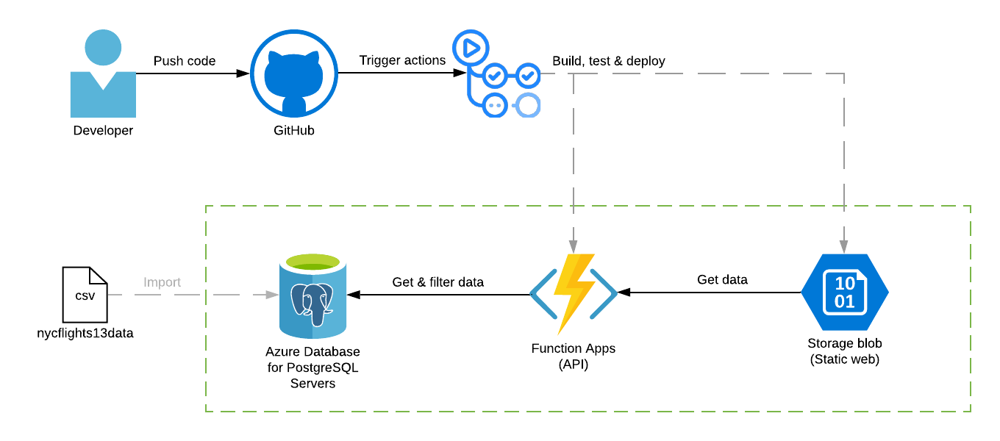

# SEP6 Project

## About

A repository for the 6th semester's Semester Project. The purpose of the project was to _"examine the concept of Cloud Computing and the strategic considerations forusing Cloud Computing."_ The goal was to create a responsive website dashboard to display data from a provided dataset. The dataset is know as `ny​cflights13data` and contains airlines​, ​airports​, ​flights​, ​planes​, and ​weather​ data.

The application is hosted here: https://sep6client.z6.web.core.windows.net/

## Architecture

## Notes

We didn't consider things such as security, authentication or data caching. These were all outside of the project scope. The API is globaly accessible and doesn't require to pass an access key. The database's inbound IPs are whitelisted to outbound IPs of the API only (meaning the database is only accessible from the API). A better solution would be implementation of an Application Gateway (with auth) in front of the API, to allow only authenticated users to access.
